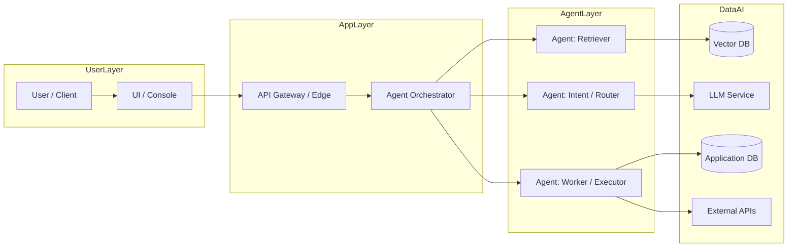

# AI Solution Architecture Template

> Use this template to document the architecture of your AI/agentic system. Focus on high-level design, agent orchestration, integration points and architectural decisions. Defer implementation and low-level technical details to a separate Technical Design Document.

---

## 1. Overview & Objectives
- **Project Name:**
- **Date:**
- **Prepared by:**
- **Summary:**
	- One-paragraph overview of the proposed solution and the value it delivers.
- **Primary Business Objectives & KPIs:**

## 2. Solution Context
- **Problem Statement & Motivation:**
- **Scope & Boundaries:**
- **Primary Stakeholders:**
- **Key Assumptions & Constraints:**

## 3. High-level Architecture Diagrams
- Include one or more high-level diagrams (Mermaid, draw.io, Lucidchart, PNG) showing system components and major data/interaction flows.
- **Diagram Notes:** Explain key components and how they interact.

### Sample Mermaid Diagram (example)

Provide one or more diagrams here tailored to your solution. Attach images or paste Mermaid blocks as needed.

## 4. Agentic System Design
- **Agent Catalog:**
	- Name, role, responsibilities, inputs, outputs for each agent.
- **Orchestration Pattern:**
	- Centralized coordinator, decentralized peer-to-peer, hierarchical, or pipeline. Describe how tasks are delegated and composed.
- **Communication & Protocols:**
	- Message formats, event bus, API contracts, retry/fallback behavior.
- **Human-in-the-Loop (HITL) Points:**
	- Where human review, approval, feedback, or intervention is required.

## 5. Data & Model Architecture (High-level)
- **Data Sources & Ingestion:**
	- Source systems, ETL/streaming paths, frequency, and retention.
- **Feature Stores / Data Stores:**
	- Where processed data and embeddings live (vector DBs, relational stores, blob storage).
- **Model Roles & Placement:**
	- Which models are used for which tasks (intent, retrieval, generation, ranking), and where they run (cloud, edge, managed service).
- **RAG / KB / Vector Strategy:**
	- Retrieval flow, embedding strategy, vector DB choice and shard/partition considerations.

## 6. Integration & APIs
- **Internal APIs & Contracts:**
	- Agent-to-agent and agent-to-service API shapes and SLAs.
- **External Integrations:**
	- Third-party services, data providers, and their constraints.

## 7. Non-functional Architecture Considerations
- **Scalability Approach:**
	- Horizontal vs vertical scaling, autoscaling triggers, bottleneck mitigation.
- **Reliability & Fault Tolerance:**
	- Retry policies, circuit breakers, graceful degradation strategies.
- **Performance & Latency Targets:**
	- End-to-end latency SLOs for critical flows.
- **Security & Compliance:**
	- Data classification, encryption-at-rest/in-transit, authN/authZ model, audit/logging needs.

## 8. Operational & MLOps Considerations
- **Monitoring & Observability:**
	- Metrics, traces, logging, and behavioral monitoring for agents and models.
- **Model Lifecycle Management:**
	- Versioning, canary/blue-green deployment strategies, rollback plans.
- **Incident Response & Runbooks:**
	- Key runbooks for degraded model behavior or data incidents.

## 9. Risk, Ethics & Governance
- **Key Risks & Mitigations:**
	- Data quality, hallucinations, model drift, cost overruns.
- **Ethics & Fairness Considerations:**
	- Bias testing, explainability, user transparency points.
- **Regulatory / Compliance Notes:**

## 10. Key Architectural Decisions (Decision Log)
- Decision ID / Date / Owner / Decision Summary / Rationale / Alternatives Considered / Impact

## 11. Open Questions & Next Steps
- List outstanding architectural questions, blockers, and recommended next actions (prototyping, benchmarks, PoC scope).

---

*Keep this architecture document high-level and focused on decisions that affect system design. Move implementation specifics (API schemas, class diagrams, detailed infra IaC) to the Technical Design Document.*

