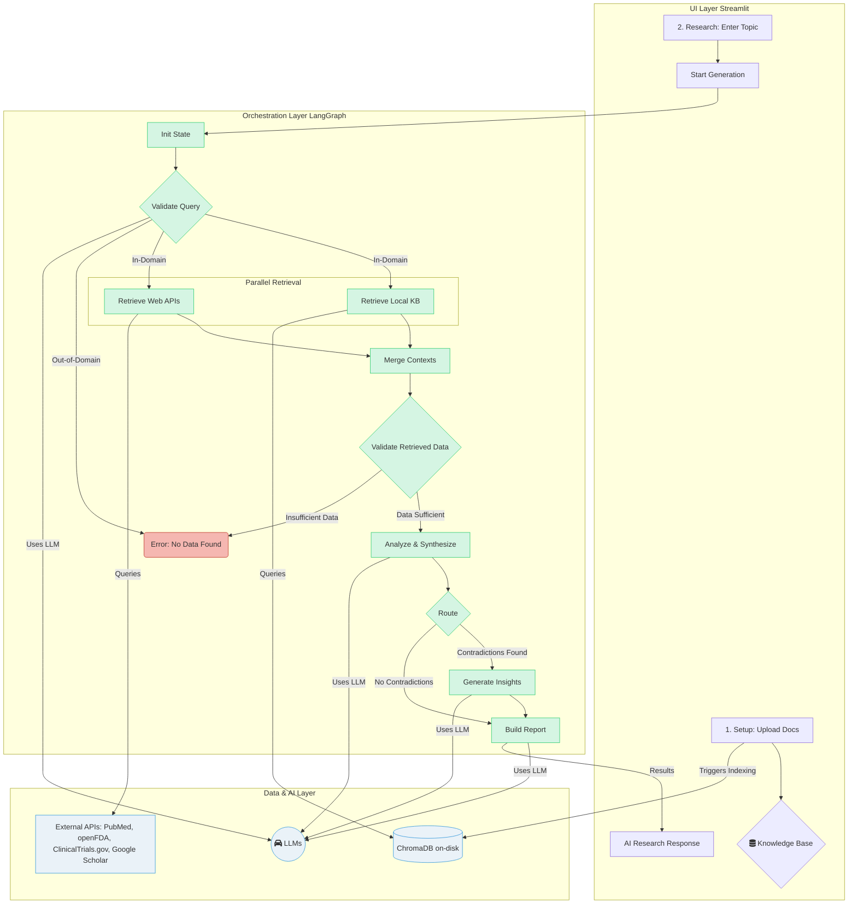

# AI Solution Architecture: Multi-agent AI Deep Researcher (MVP)

> This document outlines the architecture for the Minimum Viable Product (MVP) of the Multi-agent AI Deep Researcher, designed for the hackathon. It focuses on a stateful, agentic workflow that is demonstrable and effective.

---

## 1. Overview & Objectives
- **Project Name:** Multi-agent AI Deep Researcher (Medical Domain Focus)
- **Date:** 2025-11-08
- **Prepared by:** AI Solution Architect
- **Summary:**
	- This document describes a multi-agent AI system designed to assist medical researchers. The solution automates the process of deep research by integrating a user's private knowledge base with external medical data sources (PubMed, openFDA). It uses a team of specialized AI agents, orchestrated in a stateful graph, to perform critical analysis, generate novel hypotheses, and produce a structured, data-driven report.
- **Primary Business Objectives & KPIs:**
    - **Objective 1:** Automate the research process of collating, summarizing, and analyzing medical information from multiple sources.
    - **Objective 2:** Demonstrate the ability to uncover a hidden connection or generate a novel, data-driven hypothesis.
    - **Objective 3:** Produce a structured, coherent, and useful research report as the final output.
    - **KPI:** Successfully generate a report for a given medical topic that includes a summary, critical analysis, and at least one plausible hypothesis, with the full process completing in under 2 minutes for the live demo.

## 2. Solution Context
- **Problem Statement & Motivation:**
    - Medical researchers face a time-consuming and fragmented process for conducting deep research. They lack efficient tools to integrate their existing knowledge base with new web-sourced information, perform critical analysis at scale, and uncover non-obvious connections in the data.
- **Scope & Boundaries:**
    - **In Scope (MVP):** A Streamlit UI for file upload and research initiation; indexing of `.txt`, `.pdf`, `.csv` files into a persistent ChromaDB vector store; integration with PubMed and openFDA APIs; a multi-agent system built with LangGraph; and generation of a structured Markdown report.
    - **Out of Scope (MVP):** User accounts, management of individual files in the KB, support for other document types or web sources, user-defined report templates, and a production-grade UI.
- **Primary Stakeholders:** Hackathon Team, Hackathon Judges.
- **Key Assumptions & Constraints:**
    - **Assumptions:** Stable, public access to PubMed and openFDA APIs; LLMs possess sufficient reasoning capabilities for hypothesis generation.
    - **Constraints:** The entire "Generate Report" workflow must complete within 2 minutes for the demo; technology choices are optimized for rapid MVP development and demonstration.

## 3. High-level Architecture Diagrams

The architecture is designed as a stateful graph where a central orchestrator passes a state object between different nodes (agents). Each node processes the state and appends its findings, allowing for complex, conditional flows.

- **Diagram Notes:** The workflow now includes two critical validation steps. A `Validate Query` node first checks if the user's topic is within the medical domain. If it is, the system proceeds with parallel data retrieval. After retrieval, a `Validate Retrieved Data` node checks if enough information was found. These guardrails prevent the system from wasting resources and provide clear, immediate feedback to the user.

## 4. Agentic System Design
- **Agent Catalog (as LangGraph Nodes):**
	- **Node 1: Validate Query:**
        - **Role:** Acts as a domain guardrail before any work is done.
        - **Inputs:** Research Topic.
        - **Responsibilities:** Uses a fast LLM to classify if the topic is within the medical/healthcare domain.
        - **Outputs:** A routing decision: proceed or terminate with an "out of domain" error.
	- **Node 2a: Knowledge Base Retriever (Parallel):**
        - **Role:** Gathers relevant information from the local knowledge base.
        - **Inputs:** Research Topic.
        - **Responsibilities:** Query the ChromaDB vector store.
        - **Outputs:** A collection of text chunks from user documents.
	- **Node 2b: Web Researcher (Parallel):**
        - **Role:** Gathers fresh information from external medical sources.
        - **Inputs:** Research Topic.
        - **Responsibilities:** Query the PubMed, openFDA, ClinicalTrials.gov, and Google Scholar APIs.
        - **Outputs:** A collection of text chunks from web APIs.
    - **Node 3: Merge Contexts:**
        - **Role:** A utility node to combine outputs from the parallel retrieval steps.
        - **Inputs:** Outputs from the KB Retriever and Web Researcher.
        - **Responsibilities:** Aggregate all text chunks into a single collection.
        - **Outputs:** A unified collection of all retrieved documents.
    - **Node 4: Validate Retrieved Data:**
        - **Role:** Acts as a data sufficiency guardrail.
        - **Inputs:** The merged collection of documents.
        - **Responsibilities:** Check if the number of retrieved documents is greater than a minimum threshold.
        - **Outputs:** A routing decision: proceed or terminate with an "insufficient data" error.
	- **Node 5: Critical Analysis Agent:**
        - **Role:** Summarizes, validates, and flags issues in the data.
        - **Inputs:** The merged collection of documents.
        - **Responsibilities:** Summarize findings, check for cross-source validation, and identify contradictions.
        - **Outputs:** A structured analysis object.
    - **Node 6: Insight Generation Agent (Optional):**
        - **Role:** The core reasoning agent that forms novel hypotheses.
        - **Inputs:** The analysis object.
        - **Responsibilities:** Propose novel hypotheses based on contradictions and gaps.
        - **Outputs:** A list of generated hypotheses.
    - **Node 7: Report Builder Agent:**
        - **Role:** Compiles all findings into the final report.
        - **Inputs:** Summaries, analysis, and optional hypotheses.
        - **Responsibilities:** Format the inputs into the required Markdown structure.
        - **Outputs:** A single, final Markdown string.
- **Orchestration Pattern:**
	- A **centralized, stateful graph** orchestrated by **LangGraph**. The workflow is managed by a shared, mutable state object that is passed between nodes. Each node reads from and updates this state. This pattern is explicitly chosen for its support of advanced capabilities like **content-based dynamic routing** (e.g., taking different paths based on analysis findings) and **stateful recovery loops** (e.g., retrying a failed node). The detailed structure of the state object and the step-by-step workflow will be elaborated in a Technical Design Document.
- **Communication & Protocols:**
	- For the MVP, communication is handled in-memory via the LangGraph state object within a single Python process. No network protocols are needed for inter-agent communication.
- **Human-in-the-Loop (HITL) Points:**
	- The MVP workflow is fully automated and does not include any HITL points during report generation. Human interaction is limited to initiating the process and consuming the final report.

## 5. Data & Model Architecture (High-level)
- **Data Sources & Ingestion:**
	- **User-Provided:** `.txt`, `.pdf`, `.csv` files uploaded via the Streamlit UI and indexed on-demand.
    - **External:** PubMed, openFDA, ClinicalTrials.gov, and Google Scholar, queried live via their public REST APIs during the "Retrieve Context" step.
- **Feature Stores / Data Stores:**
	- **ChromaDB:** Used as the vector store, running in-process and persisting to the local filesystem. It stores the embeddings and content of user-provided documents.
- **Model Roles & Placement:**
    - A hybrid model strategy is employed to balance performance and cost.
	- **Embedding Model:** A specialized, small model for generating text embeddings (e.g., `nomic-embed-text` via Ollama/OpenRouter).
	- **Small Models (Fast Inference):** Used for summarization, data extraction, and formatting. (e.g., `Llama3-8B`, `Mistral-7B`, `gemma-7b` via Ollama/OpenRouter).
	- **Large Models (High-Reasoning):** Reserved for complex, high-value tasks like critical analysis, contradiction detection, and hypothesis generation. (e.g., `GPT-4o`, `Claude 3 Opus`, `Gemini 1.5 Pro` via OpenRouter, or a large local model via Ollama).
- **RAG / KB / Vector Strategy:**
	- A straightforward Retrieve-Augment-Generate (RAG) flow. When a research task starts, the topic is used to perform a similarity search against the ChromaDB knowledge base. The retrieved text chunks are then "augmented" with the real-time data from PubMed/openFDA, and this combined context is passed to the LLMs for "generation" and analysis.

## 6. Integration & APIs
- **Internal APIs & Contracts:**
	- None. The system is a single, monolithic application for the MVP.
- **External Integrations:**
	- **Ollama:** Interacted with via its OpenAI-compatible API endpoint for local development.
    - **OpenRouter:** Interacted with via its OpenAI-compatible API endpoint for demo/staging.
    - **PubMed/openFDA/ClinicalTrials.gov/Google Scholar:** Standard RESTful API calls using a library like `requests` or `httpx`.

## 7. Non-functional Architecture Considerations
- **Scalability Approach:** Not an MVP concern. The system is designed for a single user in a single process.
- **Reliability & Fault Tolerance:** Minimal for MVP. API calls to external services should be wrapped in simple retry logic (e.g., using the `tenacity` library).
- **Performance & Latency Targets:** The end-to-end generation process must complete in **under 2 minutes**. This will be achieved by the hybrid model strategy, using fast models for non-critical tasks.
- **Security & Compliance:** Not an MVP focus. API keys for OpenRouter should be loaded from environment variables, not hardcoded.

## 8. Operational & MLOps Considerations
- Out of scope for the hackathon MVP. All processes are run manually.

## 8.1. Error Handling Strategy
- **Approach:** Error handling will be integrated directly into the LangGraph workflow. Each agent node will be designed to catch exceptions during its execution. Upon an error, the graph's shared state object will be updated with error details (e.g., node name, error message).
- **Graceful Degradation:** Conditional edges in the graph will detect the presence of an error in the state and route the execution to a dedicated error handling node. This node will log the error, formulate a user-friendly message, and ensure a graceful termination of the process, preventing crashes and providing clear feedback to the user.

## 8.2. Observability Strategy
- **Tooling:** **LangSmith** will be utilized for comprehensive observability.
- **Integration:** LangSmith integration will be enabled via environment variables (`LANGCHAIN_TRACING_V2`, `LANGCHAIN_API_KEY`, `LANGCHAIN_PROJECT`). LangChain/LangGraph will automatically send detailed traces to LangSmith.
- **Benefits:** This provides invaluable insights into agent execution paths, LLM calls, tool usage, latencies, and token consumption. It will be crucial for debugging during development and verifying performance during the demo.

## 9. Risk, Ethics & Governance
- **Key Risks & Mitigations:**
	- **LLM Hallucination:** Risk of generating factually incorrect analysis or hypotheses. Mitigation: The Critical Analysis Agent is designed to validate points across multiple sources. The final report will include all sources for human verification.
    - **API Unreliability:** External APIs may be slow or fail. Mitigation: Implement basic request retries.
    - **Low-Quality Output:** The generated report may not be useful. Mitigation: Careful prompt engineering and use of high-quality models for reasoning tasks.
- **Ethics & Fairness Considerations:**
	- Generating incorrect medical information is a serious risk. The UI and report must clearly state that **this is an AI-generated document for research assistance and must be verified by a human expert.**

## 10. Key Architectural Decisions (Decision Log)

| ID | Decision Summary | Rationale | Alternatives Considered |
|:---|:---|:---|:---|
| 1 | Use **LangGraph** for agent orchestration. | Provides a robust, stateful, and extensible framework for defining complex agentic workflows. Its graph-based nature is ideal for managing state and conditional logic, offering more control than simpler pipeline tools. | CrewAI (simpler abstraction, less control), simple Python scripts (brittle). |
| 2 | Use **ChromaDB** for the vector store. | Extremely simple to set up for the MVP. It runs in-process and persists to disk, meeting the persistence requirement without the overhead of a separate database server. | FAISS (library, not a DB; more boilerplate), other vector DBs (more complex setup). |
| 3 | Mutil-model LLM strategy (**Ollama/local** for dev, **OpenRouter** for demo). | Balances cost, performance, and developer flexibility. Allows using powerful, expensive models only for critical reasoning tasks while using small, fast, and cheap models for simpler tasks like formatting and summarization. | Single large model (expensive, potentially slow), single small model (low quality). |

## 11. Open Questions & Next Steps
- **Open Questions:**
    - Which specific small and large models offer the best performance/cost/latency trade-off? (e.g., Llama3-8B vs. Mistral-7B vs. Gemma-7B? Claude 3 Sonnet vs. Opus vs. GPT-4o?).
    - What is the optimal chunking strategy for document ingestion to maximize retrieval relevance?
- **Next Steps:**
    - Develop a PoC of the LangGraph state machine with mock agent nodes.
    - Benchmark the latency and quality of at least two small and two large models for their designated tasks.
    - Implement the file ingestion and ChromaDB indexing pipeline.

## 12. Future Considerations (Beyond MVP)
- **Reviewer Agent & Rework Loops:** Implement a "critic" agent that reviews the generated report for quality and can loop back to the report builder with feedback for revisions.
- **Graph-Level Recovery:** Implement stateful retry/recovery loops to handle node failures gracefully (e.g., retrying a timed-out API call after a delay).
- **Advanced Dynamic Routing:** Enhance the routing logic to support more complex workflows, such as spawning a "deepen research" sub-graph if a significant knowledge gap is identified.
- **Human-in-the-Loop (HITL):** Introduce nodes that pause the graph and wait for human input, such as requiring a user to approve a generated hypothesis before it is included in the final report.
- **Expanded Tool Use:** Provide agents with a wider array of tools (e.g., a calculator for statistical analysis, a code interpreter for running simulations) to answer more complex questions.
- **Scalability:** Transition from an in-process ChromaDB to a standalone vector database server and containerize the application to support concurrent users and larger workloads.
